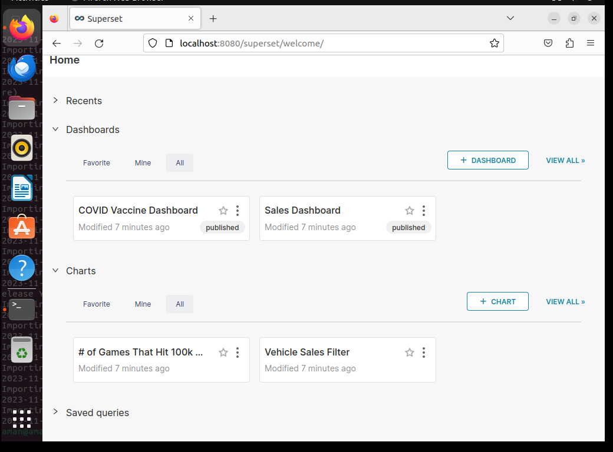

# Superset


## 1. Overview

This document provides a step-by-step overview of setting up Apache using Podman and on an Ubuntu 22.04 system.


## 2. Task requirement

To install the superset with a podman. 


## 3. Definition of superset

Superset is a tool that helps people look at data and make graphs and charts easily. It can be used instead of expensive business tools and works with different types of data. You can use it to create charts without knowing how to code it's simple and quick.


## 3.  Environment details

OS: Ubuntu 22.04 (64 bit)</br>
CPU: 2 core </br>
RAM:  2GB </br>


## 4.  List of tools and technologies

Podman version 3.4.2


## 5. Definition of tool

**Podman** - It is an open-source tool for developing, managing, and running containers on your Linux systems. 


## 6. command for the setup or configuration


## Step 1. Updating Packages and Repositories.

~~~
sudo apt update
~~~

**sudo:** This stands for "Superuser Do" and is used to execute commands with superuser (administrator) privileges. 
It allows you to perform actions that require elevated permissions.

**apt:** This stands for "Advanced Package Tool." The manager is used for managing software.

**update:** This is a subcommand of apt that instructs the package manager to update the package information.

( Running "sudo apt update" ensures that your system is aware of the latest software packages and updates available in the repositories. 

**Output**
```
aman@aman:~$ sudo apt update 
Hit:1 http://security.ubuntu.com/ubuntu focal-security InRelease
Hit:2 http://in.archive.ubuntu.com/ubuntu focal InRelease
Hit:3 http://in.archive.ubuntu.com/ubuntu focal-updates InRelease
Hit:4 http://in.archive.ubuntu.com/ubuntu focal-backports InRelease
Reading package lists... Done
Building dependency tree       
Reading state information... Done
244 packages can be upgraded. Run 'apt list --upgradable' to see them.
aman@aman:~$ 
```


## Step 2. Run the Upgrade command.

~~~
sudo apt upgrade
~~~

**sudo:**  This stands for "Superuser Do" and is used to execute commands with superuser (administrator) privileges. It allows you to perform actions that require elevated permissions.

**apt:** This stands for "Advanced Package Tool." You can use it to install, update, remove, and manage software packages.

**Update:** The package information is a database of available software packages, their versions, and where to download them from. 

**Output**
```
aman@aman:~$ sudo apt upgrade
Reading package lists... Done
Building dependency tree       
Reading state information... Done
Calculating upgrade... Done
The following NEW packages will be installed:
  ubuntu-pro-client-l10n
The following packages will be upgraded:
  accounts service amd64-microcode apparmor apport apport-gtk apt apt-utils avahi-autoipd avahi-daemon
  avahi-utils bind9-dnsutils bind9-host bind9-libs bolt bsdutils ca-certificates cpp-9 cups
  cups-browsed cups-bsd cups-client cups-common cups-core-drivers cups-daemon cups-filters
  cups-filters-core-drivers cups-ipp-utils cups-ppdc cups-server-common distro-info distro-info-data
  dnsmasq-base fdisk firefox fonts-opensymbol fwupd fwupd-signed gcc-10-base gcc-9-base ghostscript
  ghostscript-x gir1.2-accountsservice-1.0 gir1.2-gst-plugins-base-1.0 gir1.2-javascriptcoregtk-4.0
  gir1.2-rsvg-2.0 gir1.2-webkit2-4.0 gstreamer1.0-alsa gstreamer1.0-gl gstreamer1.0-gtk3
  gstreamer1.0-plugins-base gstreamer1.0-plugins-base-apps gstreamer1.0-plugins-good
  gstreamer1.0-pulseaudio gstreamer1.0-x intel-microcode iptables krb5-locales libaccountsservice0

  ```


## Step 3. Run the following command to install Podman.

~~~
 sudo apt install podman 
~~~

**sudo:** Provides administrative privileges to the command. allowing you to make changes to the system.

**apt:** Refers to the APT package manager used for managing software.

**install:** is the action you want to perform, which means you want to add the specified software to your system.

**Podman:** is the name of the software you want to install. Podman is a tool used for managing containers.


**Output**
```
aman@aman:~$ sudo apt install podman 
[sudo] password for aman: 
Reading package lists... Done
Building dependency tree... Done
Reading state information... Done
The following additional packages will be installed:
  buildah catatonit conmon containernetworking-plugins crun fuse-overlayfs
  golang-github-containernetworking-plugin-dnsname
  golang-github-containers-common golang-github-containers-image libostree-1-1
  libslirp0 slirp4netns uidmap
Suggested packages:
  containers-storage docker-compose
The following NEW packages will be installed:
  buildah catatonit conmon containernetworking-plugins crun fuse-overlayfs
  golang-github-containernetworking-plugin-dnsname
  golang-github-containers-common golang-github-containers-image libostree-1-1
  libslirp0 podman slirp4netns uidmap
0 upgraded, 14 newly installed, 0 to remove and 117 not upgraded.
Need to get 25.4 MB of archives.
```


## Step 4. Run the following command to check the Podman version.

~~~
 podman version 
~~~
**Podman:** is a tool that helps you manage containers, which are like virtual machines for running applications.

**version:** You're checking which edition of Podman you have. It's like checking if you have the latest or older version with improvements or fixes.


 **Output**
```
aman@aman:~$ podman version 
Version:      3.4.4
API Version:  3.4.4
Go Version:   go1.18.1
Built:        Thu Jan  1 05:30:00 1970
OS/Arch:      linux/amd64
aman@aman:~$ 

```


## Step 5. Run the echo command

~~~
echo -e "[registries.search]\nregistries = ['docker.io']" | sudo tee /etc/containers/registries.conf
~~~
**echo**: Prints text to the terminal.

-e: Enables interpretation of backslash escapes (like \n for a newline).

"[registries.search]\nregistries = ['docker.io']": The text to be printed. It configures container registries, specifying that it should search for images on docker.io.
|: Sends the output of the echo command as input to the next command.

sudo: Runs the following command with superuser (administrator) privileges.

tee /etc/containers/registries.conf: Writes the echoed text to the specified file (/etc/containers/registries.conf) with superuser permissions.


**Output**
```
aman@aman:~$ echo -e "[registries.search]\nregistries = ['docker.io']" | sudo tee /etc/containers/registries.conf
[registries.search]
registries = ['docker.io']
aman@aman:~$ 
```


## Step 6. Pull Apache in superset.

~~~
podman pull apache/superset
~~~

**podman**: A container management tool similar to Docker.

**pull**: Command used to download a container image from a container registry.

**Apache/superset:** The name of the container image to pull. In this case, it's the Apache Superset image.


**Output**
```
aman@aman:~$ podman pull apache/superset
Resolving "apache/superset" using unqualified-search registries (/etc/containers/registries.conf)
Trying to pull docker.io/apache/superset:latest...
Getting image source signatures
Copying blob c11bdfacfd25 done  
Copying blob c2cc0c2c5762 done  
Copying blob a378f10b3218 done  
Copying blob 8ad08235b1d3 done  
Copying blob b41d32331f87 done  
Copying blob 8529ad8df27f done  
Copying blob 45a99dbb690d done  
Copying blob cc3bcdb50319 done  
Copying blob eb56f90ba117 done  
Copying blob 6984b214a68a done  
Copying blob 8afe6fb8ef94 done  
Copying blob 92002a87e705 done  
Copying blob 423b4c047235 done  
Error: reading blob sha256:46a576915575cf55b3ed8e41b1b0adf1831f0275f6de6d8ddae9f098d38bbc64: Get "https://production.cloudflare.docker.com/registry-v2/docker/registry/v2/blobs/sha256/46/46a576915575cf55b3ed8e41b1b0adf1831f0275f6de6d8ddae9f098d38bbc64/data?verify=1700654610-BqkjBFb40X88sGvnuY0zI8SX1wo%3D": net/http: TLS handshake timeout
aman@aman:~$ 
```


## Step 7. Run the command to install vim.

~~~
sudo apt install vim
~~~


**sudo:** This part of the command is used to execute it with administrative or superuser privileges, allowing you to install software system-wide.


**apt:** Refers to the APT package manager, which is commonly used on Debian-based Linux distributions like Ubuntu to manage software packages.


**Install:** Specifies the action to be performed, which is to install a package.

**Vim:**- It is a highly configurable text editor built to make creating and changing any kind of text very efficient.

**Output**

```
aman@aman:~$ sudo apt install vim
Reading package lists... Done
Building dependency tree... Done
Reading state information... Done
The following additional packages will be installed:
  vim-common vim-runtime vim-tiny
Suggested packages:
  ctags vim-doc vim-scripts indent
The following NEW packages will be installed:
  vim vim-runtime
The following packages will be upgraded:
  vim-common vim-tiny
2 upgraded, 2 newly installed, 0 to remove and 115 not upgraded.
Need to get 8,568 kB/9,359 kB of archives.
After this operation, 37.6 MB of additional disk space will be used.
Do you want to continue? [Y/n] y
```


## Step 8. Run command openssl.

~~~
openssl rand -base64 42
~~~

**openssl**: A command-line tool for using the OpenSSL library, often used for cryptographic operations.

rand: Specifies the random number generator command in OpenSSL.

-base64: Instructs OpenSSL to encode the random bytes in Base64 format.

42: Specifies the number of bytes to generate.


**output**

```
aman@aman:~$ openssl rand -base64 42
bpAbwShYgeG2EVpm5I/c+kV79UhhXhBUKGQJtR4shUKhMt/QJl3hWGWN

```


## Step 9.  Create a file.

~~~
 vim superset_config.py
~~~

**vim**: A text editor used in the command line.

**Output**

```
SECRET_KEY =' bpAbwShYgeG2EVpm5I/c+kV79UhhXhBUKGQJtR4shUKhMt/QJl3hWGWN'
~                                                                                                       
~                                                                                                       
~                                                                                                     
~                                                                                                       
~                                                                                                       
~                                                                                                                                                                                             
"superset_config.py" 1L, 72B                                                          1,71          All
```


**Note:-** in this file save the above generate key.


## Step 10. To create a podman container.

~~~
podman run -d -p 8080:8088 -e "SUPERSET_SECRET_KEY=your_secret_key_here" --name superset apache/superset 
~~~
**podman**: A container management tool similar to Docker.

run Command to start a new container.

-d: Runs the container in the background (detached mode).

-p 8080:8088: Maps port 8088 from the container to port 8080 on the host system.

-e "SUPERSET_SECRET_KEY=your_secret_key_here": Sets an environment variable SUPERSET_SECRET_KEY with the specified value.

--name superset: Assign the name "superset" to the running container.

apache/superset: Specifies the container image to use, in this case, Apache Superset.


**Output**
```
aman@aman:~$ podman run -d -p 8080:8088 -e "SUPERSET_SECRET_KEY=your_secret_key_here" --name superset apache/superset 
Resolving "apache/superset" using unqualified-search registries (/etc/containers/registries.conf)
Trying to pull docker.io/apache/superset:latest...
Getting image source signatures
Copying blob c2cc0c2c5762 skipped: already exists  
Copying blob a378f10b3218 skipped: already exists  
Copying blob 8ad08235b1d3 skipped: already exists  
Copying blob c11bdfacfd25 skipped: already exists  
Copying blob 8529ad8df27f skipped: already exists  
Copying blob b41d32331f87 skipped: already exists  
Copying blob 45a99dbb690d skipped: already exists  
Copying blob cc3bcdb50319 skipped: already exists  
Copying blob eb56f90ba117 done  
Copying blob 8afe6fb8ef94 done  
Copying blob 423b4c047235 done  
Copying blob 92002a87e705 done  
Copying blob 6984b214a68a done  
Copying blob 46a576915575 done  
Copying config 8a254ef5f4 done  
Writing manifest to image destination
Storing signatures
79422488e9f3019005a19f57a7f377c5ae43d089cf591e098eea453c078daca4
aman@aman:~$ 
```


## Step 11. To check podman container is running or not.

~~~
podman ps
~~~

**podman**: A container management tool similar to Docker.

**ps**: Stands for "process status." It shows the status of currently running containers.


**Output**

```
aman@aman:~$ podman ps
CONTAINER ID  IMAGE                             COMMAND               CREATED             STATUS                 PORTS                   NAMES
79422488e9f3  docker.io/apache/superset:latest  /usr/bin/run-serv...  About a minute ago  Up About a minute ago  0.0.0.0:8080->8088/tcp  superset
aman@aman:~$ 
```


## Step 12. Set up your local admin account.

~~~
 podman exec -it superset superset fab create-admin \
              --username admin \
              --firstname Superset \
              --lastname Admin \
              --email admin@superset.com \
              --password admin
~~~

**podman**: A container management tool similar to Docker.

exec: Executes a command in a running container.

-it: Specifies an interactive terminal.


superset: The name of the container in which to execute the command.

superset fab create-admin: Runs the Superset command-line tool (fab) to create a new admin user.

--username admin: Specifies the username for the new admin user.
--firstname Superset: Specifies the first name for the new admin user.
--lastname Admin: Specifies the last name for the new admin user.
--email admin@superset.com: Specifies the email address for the new admin user.
--password admin: Specifies the password for the new admin user.

So, in, this command creates a new admin user in a running Superset container with specified details such as username, first name, last name, email, and password.


**Output**

```
aman@aman:~$ podman exec -it superset superset fab create-admin \
              --username admin \
              --firstname Superset \
              --lastname Admin \
              --email admin@superset.com \
              --password admin
logging was configured successfully
2023-11-22 11:34:00,308:INFO:superset.utils.logging_configurator:logging was configured successfully
2023-11-22 11:34:00,313:INFO:root:Configured event logger of type <class 'superset.utils.log.DBEventLogger'>
/usr/local/lib/python3.9/site-packages/flask_limiter/extension.py:293: UserWarning: Using the in-memory storage for tracking rate limits as no storage was explicitly specified. This is not recommended for production use. See: https://flask-limiter.readthedocs.io#configuring-a-storage-backend for documentation about configuring the storage backend.
  warnings.warn(
Recognized Database Authentications.
Admin User admin created.
aman@aman:~$ 
```


## Step 13. Migrate local DB to the latest.

~~~
 podman exec -it superset superset db upgrade
~~~

**podman**: A container management tool similar to Docker.

exec: Executes a command in a running container.

-it: Specifies an interactive terminal.

superset: The name of the container in which to execute the command.

superset db upgrade: Runs the Superset command to apply database migrations, updating the database schema.


**Output**

```
aman@aman:~$ podman exec -it superset superset db upgrade
logging was configured successfully
2023-11-22 11:35:49,533:INFO:superset.utils.logging_configurator:logging was configured successfully
2023-11-22 11:35:49,539:INFO:root:Configured event logger of type <class 'superset.utils.log.DBEventLogger'>
/usr/local/lib/python3.9/site-packages/flask_limiter/extension.py:293: UserWarning: Using the in-memory storage for tracking rate limits as no storage was explicitly specified. This is not recommended for production use. See: https://flask-limiter.readthedocs.io#configuring-a-storage-backend for documentation about configuring the storage backend.
  warnings.warn(
WARNI [alembic.env] SQLite Database support for metadata databases will         be removed in a future version of Superset.
INFO  [alembic.runtime.migration] Context impl SQLiteImpl.
INFO  [alembic.runtime.migration] Will assume transactional DDL.
INFO  [alembic.runtime.migration] Running upgrade  -> 4e6a06bad7a8, Init
INFO  [alembic.runtime.migration] Running upgrade 4e6a06bad7a8 -> 5a7bad26f2a7, empty message
INFO  [alembic.runtime.migration] Running upgrade 5a7bad26f2a7 -> 1e2841a4128, empty message
INFO  [alembic.runtime.migration] Running upgrade 1e2841a4128 -> 2929af7925ed, TZ offsets in data sources
INFO  [alembic.runtime.migration] Running upgrade 2929af7925ed -> 289ce07647b, Add encrypted password field
```


## Step 14. Setup roles.

~~~
podman  exec -it superset superset init
~~~

**podman**: A container management tool similar to Docker.

exec: Executes a command in a running container.

-it: Specifies an interactive terminal.

superset: The name of the container in which to execute the command.

superset init: Initializes Superset, often used for setting up initial configurations and structures.


**Output**

```
aman@aman:~$ podman  exec -it superset superset init
logging was configured successfully
2023-11-22 11:42:08,847:INFO:superset.utils.logging_configurator:logging was configured successfully
2023-11-22 11:42:08,852:INFO:root:Configured event logger of type <class 'superset.utils.log.DBEventLogger'>
/usr/local/lib/python3.9/site-packages/flask_limiter/extension.py:293: UserWarning: Using the in-memory storage for tracking rate limits as no storage was explicitly specified. This is not recommended for production use. See: https://flask-limiter.readthedocs.io#configuring-a-storage-backend for documentation about configuring the storage backend.
  warnings.warn(
Syncing role definition
2023-11-22 11:42:16,625:INFO:superset.security.manager:Syncing role definition
Syncing Admin perms
2023-11-22 11:42:16,831:INFO:superset.security.manager:Syncing Admin perms
Syncing Alpha perms
2023-11-22 11:42:16,845:INFO:superset.security.manager:Syncing Alpha perms
Syncing Gamma perms
2023-11-22 11:42:17,134:INFO:superset.security.manager:Syncing Gamma perms
Syncing sql_lab perms
2023-11-22 11:42:17,306:INFO:superset.security.manager:Syncing sql_lab perms
Fetching a set of all perms to lookup which ones are missing
2023-11-22 11:42:17,473:INFO:superset.security.manager:Fetching a set of all perms to lookup which ones are missing
Creating missing datasource permissions.
2023-11-22 11:42:17,482:INFO:superset.security.manager:Creating missing datasource permissions.
Creating missing database permissions.
2023-11-22 11:42:17,487:INFO:superset.security.manager:Creating missing database permissions.
Cleaning faulty perms
2023-11-22 11:42:17,493:INFO:superset.security.manager:Cleaning faulty perms
aman@aman:~$ 
```


## Step 15. Load Examples.


~~~
 podman exec -it superset superset load_examples
~~~

**podman**: A container management tool similar to Docker.

exec: Executes a command in a running container.

-it: Specifies an interactive terminal.

superset: The name of the container in which to execute the command.

superset load_examples: Runs the Superset command to load example data or dashboards.


**Output**

```
aman@aman:~$  podman exec -it superset superset load_examples
logging was configured successfully
2023-11-22 11:43:22,265:INFO:superset.utils.logging_configurator:logging was configured successfully
2023-11-22 11:43:22,270:INFO:root:Configured event logger of type <class 'superset.utils.log.DBEventLogger'>
/usr/local/lib/python3.9/site-packages/flask_limiter/extension.py:293: UserWarning: Using the in-memory storage for tracking rate limits as no storage was explicitly specified. This is not recommended for production use. See: https://flask-limiter.readthedocs.io#configuring-a-storage-backend for documentation about configuring the storage backend.
  warnings.warn(
Creating database reference for examples
2023-11-22 11:43:23,521:INFO:superset.utils.database:Creating database reference for examples
Loading examples metadata and related data into examples
Creating default CSS templates
Loading [World Bank's Health Nutrition and Population Stats]
Creating table [wb_health_population] reference
Creating a World's Health Bank dashboard
Loading [Birth names]
Done loading table!
--------------------------------------------------------------------------------
Creating table [birth_names] reference
Creating some slices
Creating a dashboard
Loading [Random long/lat data]
Done loading table!
```


 ## Step 16. Open the browser.

 This is the correct URL is:-
 
 localhost:8080/login/ 
     
 Note:- ( User / Password )
 
 [admin/admin]

**localhost**: Refers to the local machine, meaning the same computer that you are currently using.

:8080: Specifies the port number 8080, indicating a specific communication endpoint on the local machine.

/login/: The path or route on the web server, pointing to the login page.


**Output**





