# Setup Superset

**1. Overviews**

This document provides a step-by-step overview of setting up Apache using Podman and on an Ubuntu 22.04 system.

**2. Task requirement**

To run the superset with a podman. 

**Definition of Superset**

Superset is a tool that helps people look at data and make graphs and charts easily. It can be used instead of expensive business tools and works with different types of data. You can use it to create charts without knowing how to code it's simple and quick.

**3.  Environment details**

OS: Ubuntu 22.04 
     System configuration

CPU:  Intel Core i5-8350U CPU @ 1.70GHz x 8
RAM:  8GB 
Storage:  512GB 

**4.  List of tools and technologies**

Podman version 3.4.2

Others

VIM

**5. Definition of tools**

Podman - It is an open-source tool for developing, managing, and running containers on your Linux systems. 

Vim - It is a highly configurable text editor built to make creating and changing any kind of text very efficient.

**6.  Command for the setup or configuration**

**Step 1.** Run the following command to install curl.

~~~
sudo apt install curl
~~~

**sudo:** Provides administrative privileges to the command.

**apt:** Refers to the APT package manager used for managing software.

**Install:** Specifies the action to be taken, which is to install a package.

**curl:** The name of the package to be installed, a command-line tool for URL-related data transfer.

( curl :- is a command-line tool that allows you to fetch data from the internet. It's like a web browser for your terminal. You can download files, make web requests, and interact with web services directly from the command line.)

**Output**

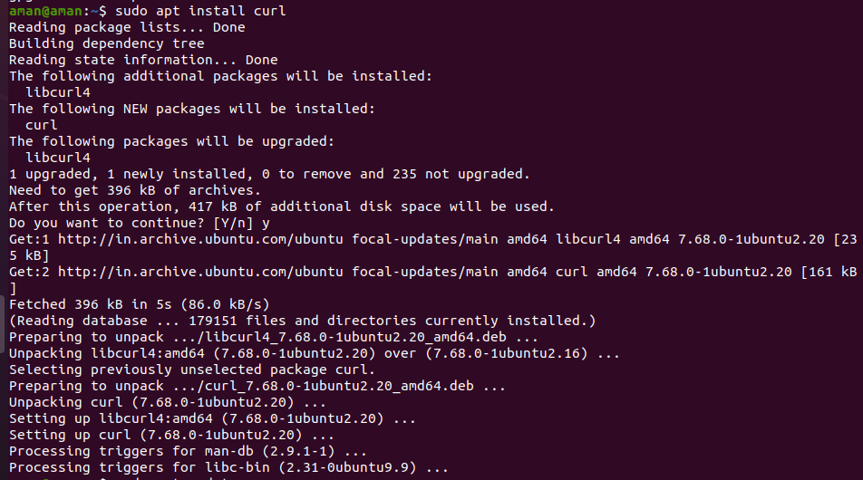

**Step 2. Updating Packages and Repositories.**

~~~
sudo apt update
~~~

**sudo:** This stands for "Superuser Do" and is used to execute commands with superuser (administrator) privileges. 
It allows you to perform actions that require elevated permissions.

**apt:** This stands for "Advanced Package Tool." manager used for managing software.

**update:** This is a subcommand of apt that instructs the package manager to update the package information.

( Running "sudo apt update" ensures that your system is aware of the latest software packages and updates available in the repositories. 

**Output**

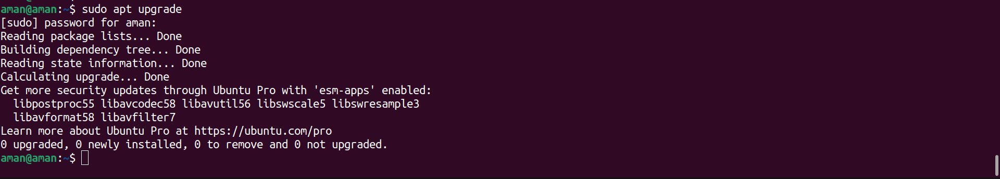

**Step 3. Run the Upgrade command.**

~~~
sudo apt upgrade
~~~

**sudo:**  This stands for "Superuser Do" and is used to execute commands with superuser (administrator) privileges. It allows you to perform actions that require elevated permissions.

**apt:** This stands for "Advanced Package Tool." You can use it to install, update, remove, and manage software packages.

**Update:** The package information is a database of available software packages, their versions, and where to download them from. 

**Output**

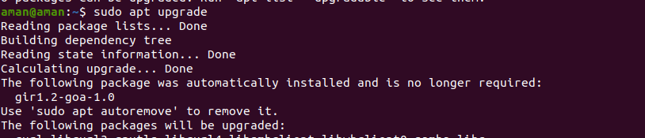

**Step 4. Run the following command to install Podman.**

~~~
 sudo apt install podman 
~~~

**sudo:** Provides administrative privileges to the command. allowing you to make changes to the system.

**apt:** Refers to the APT package manager used for managing software.

**install:** is the action you want to perform, which means you want to add the specified software to your system.

**Podman :** is the name of the software you want to install. Podman is a tool used for managing containers, similar to Docker.

**Output**

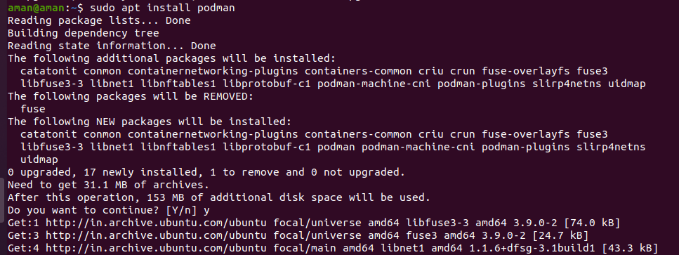

**Step 5. Run the following command to check the Podman version.**

~~~
 podman version 
~~~
**Podman :** is a tool that helps you manage containers, which are like virtual machines for running applications.

 **version :** You're checking which edition of Podman you have. It's like checking if you have the latest or older version with improvements or fixes.

 **Output**

 

**Step 6. Run the echo command**

~~~
echo -e "[registries.search]\nregistries = ['docker.io']" | sudo tee /etc/containers/registries.conf
~~~
**Output**

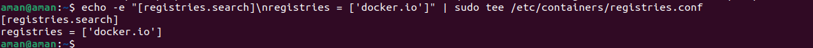

**Step 7.Pull apache in superset.**

~~~
podman pull apache/superset
~~~
**Output**
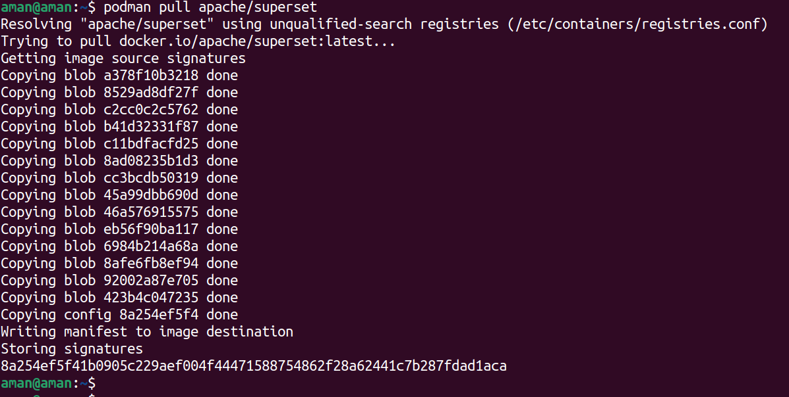

**Step 8. Run the command to install vim.**

~~~
sudo apt install vim
~~~

**sudo:** This part of the command is used to execute it with administrative or superuser privileges, allowing you to install software system-wide.

**apt:** Refers to the APT package manager, which is commonly used on Debian-based Linux distributions like Ubuntu to manage software packages.

**Install:** Specifies the action to be performed, which is to install a package.

**Vim:**- It is a highly configurable text editor built to make creating and changing any kind of text very efficient.

**Output**

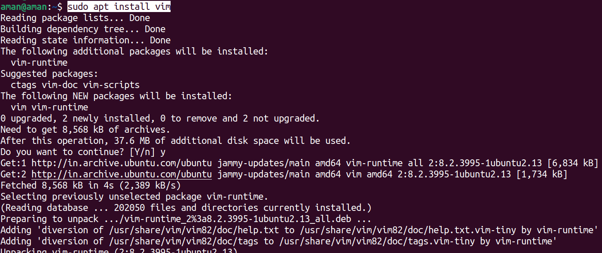

**Step 9. Run command openssl.**

~~~
openssl rand -base64 42
~~~
**output**

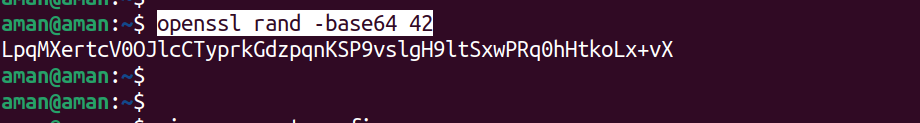

**Step 10.  To paste key in vim editor.**

~~~
 vim superset_config.py
~~~

**Output**

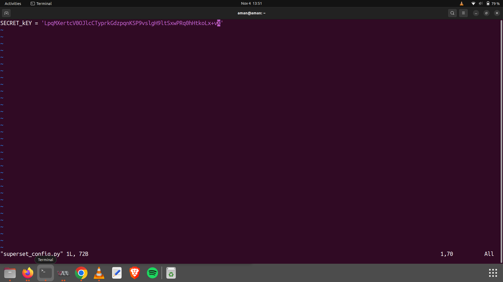

**Note:-** in this file save the above generate key.

**Step 11. To create podman container.**

~~~
podman run -d -p 8080:8088 -e "SUPERSET_SECRET_KEY=your_secret_key_here" --name superset apache/superset 
~~~

**Output**

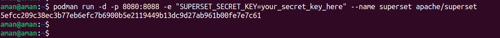

**Step 12. To check podman container is running or not.**

~~~
podman ps
~~~

**Output**

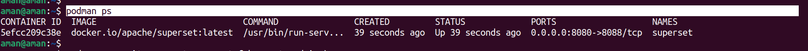

**Step 13. Set up your local admin account.**

~~~
 podman exec -it superset superset fab create-admin \
~~~

**Output**

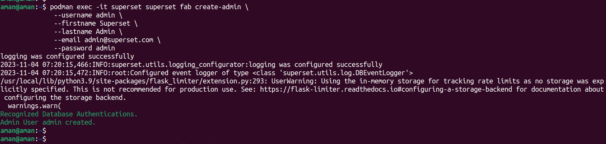

**Step 14. Migrate local DB to the latest.**

~~~
 podman exec -it superset superset db upgrade
~~~

**Output**

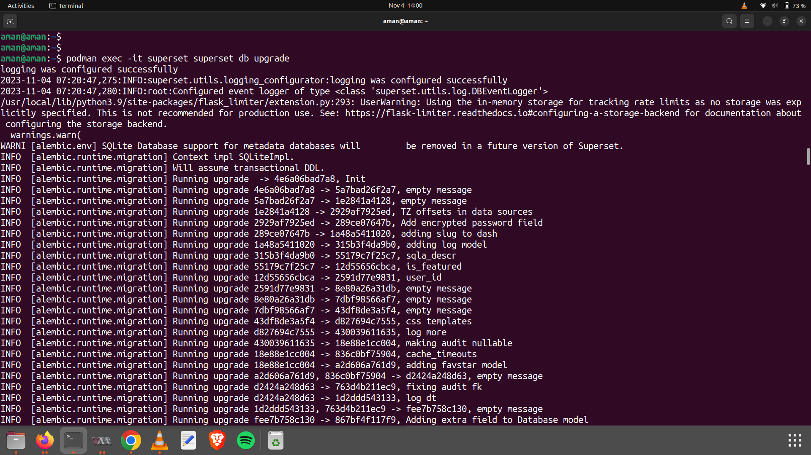

**Step 15. Setup roles.**

~~~
podman  exec -it superset superset init
~~~

**Output**

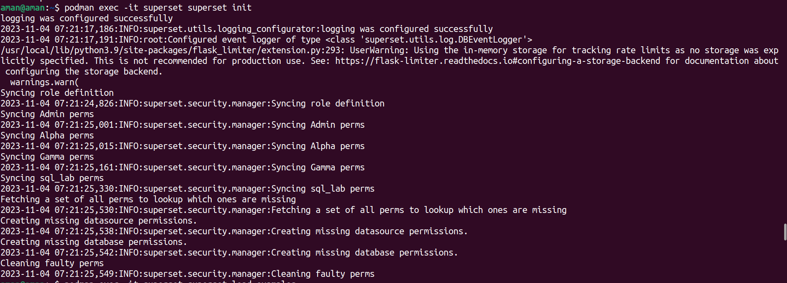

**Step16. Load Examples.**

~~~
 podman exec -it superset superset load_examples
~~~

**Output**

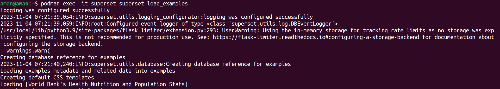

 **Step 17. Open the browser.**

     Log in and take a look -- navigate to http://localhost:8080/login/ -- u/p: [admin/admin]

**Output**

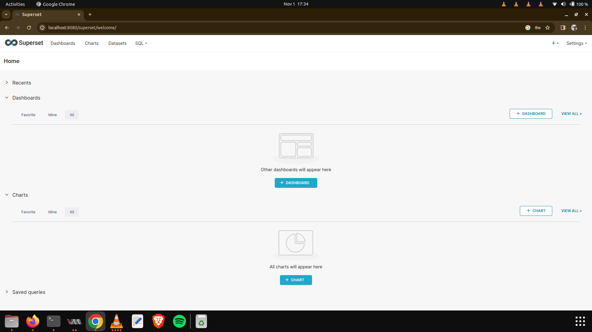

